# Logo Loco

 

Welcome to Logo Loco, the ultimate logo quiz game!

Challenge your logo knowledge and recognition skills in the most engaging and visually stimulating way. In a world brimming with countless logos that surround us every day, Logo Loco was designed with a dual purpose: to enhance awareness of iconic brands and to offer a fun and nostalgic gaming experience.

## Design

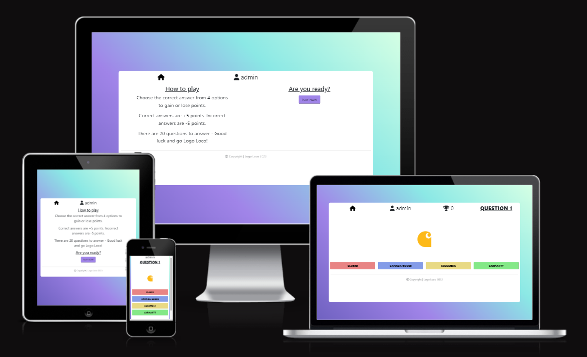

### Colors

 

Color Palette

 

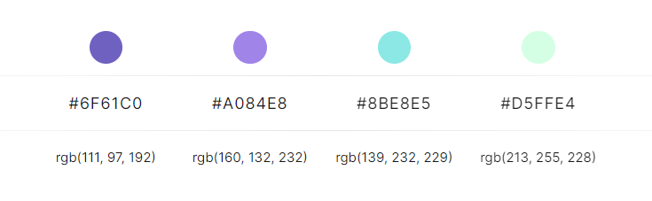

 

The color scheme for the project was obtained from [Color Hunt](https://colorhunt.co/). This palette was chosen because it has a cool and retro aesthetic that encourages a fun gaming experience while also evoking nostalgia, as if users were playing an old favorite childhood game.

### Fonts

[Google Fonts](https://fonts.google.com/) was used to generate the font family "REM" and in the event that it doesn't load, it will default to "sans-serif". REM was used throughout the project and was chosen because of its clarity and polished appearance. As the project's name implies, it's a "Logo Loco" multiple choice quiz game with a lot of colours to look at and answers to choose from, so I didn't want to overcomplicate the font style and overwhelm the users.

## Wireframes

 

Home Page

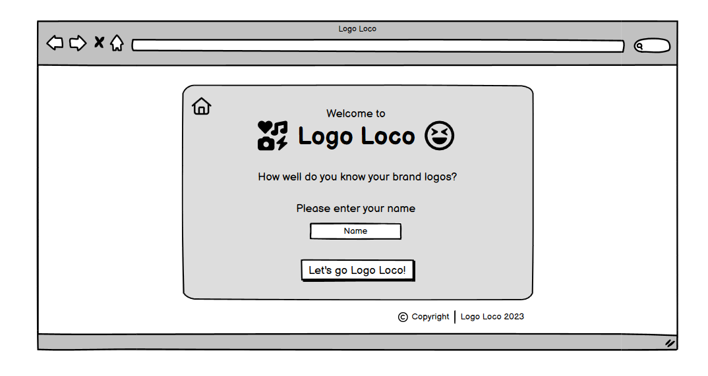

Rules & Play Now Page

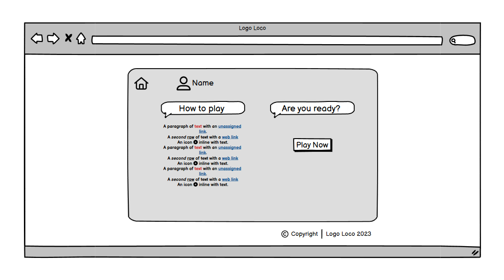

 

Game Page

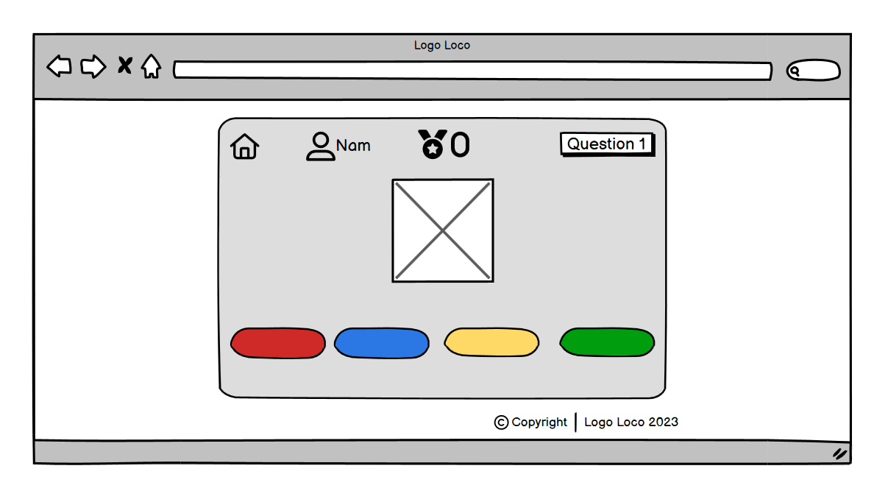

 

End Page

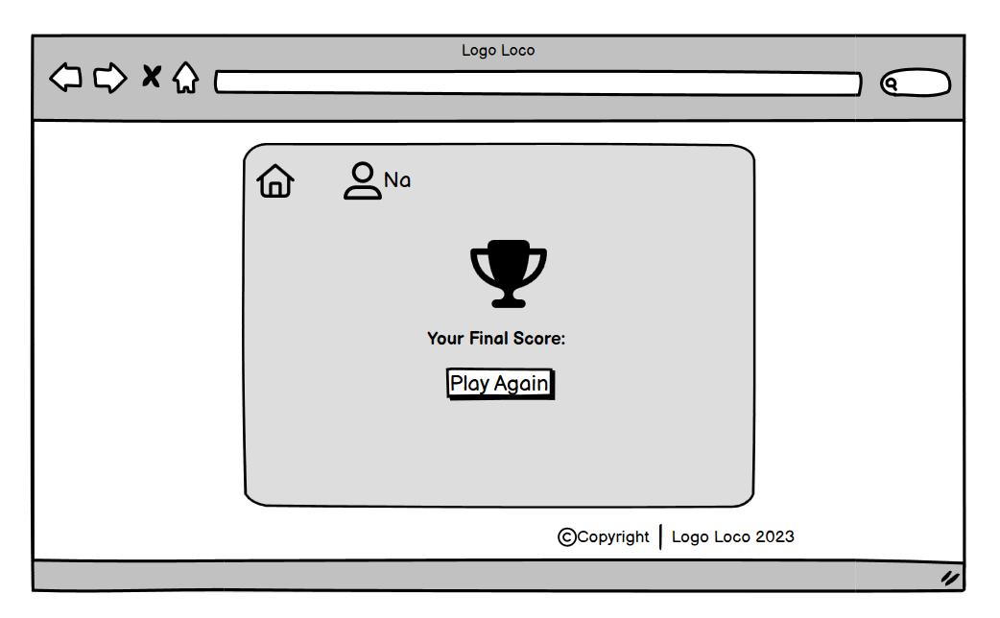

 

## Features

### Home Page
* Users are greeted with a visually appealing homepage.
* A catchy game title "Logo Loco" and a brief welcome message engage users.
* Users are prompted to enter their name to personalize the experience.
* Clear instructions and a start button guide users to begin the quiz.

### Rules and Play Now Page
* After entering the name, users are taken to the Rules and Play Now page.
* Concise rules explain how to play the game.
* A prominent "Play Now" button invites users to start the quiz.

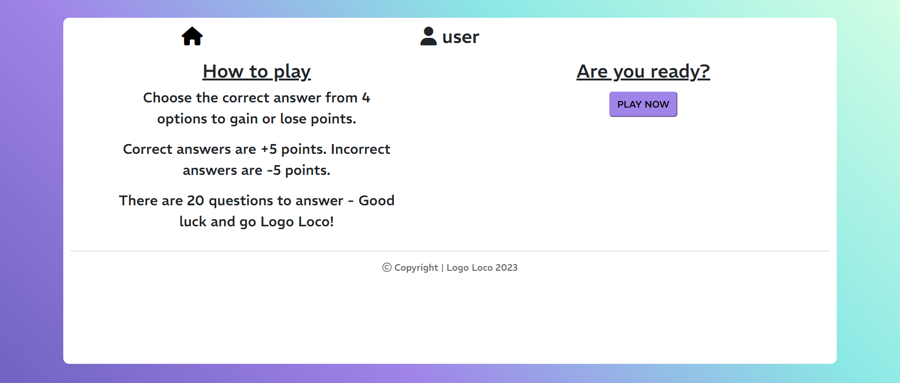
  
### Game Page
* Users are presented with logo images and multiple-choice options.
* The question number and the user's score are displayed.
* Users select answers by clicking on the provided options.
* Immediate feedback is given for correct and incorrect answers using SweetAlert2.
* The game continues until all questions are answered.

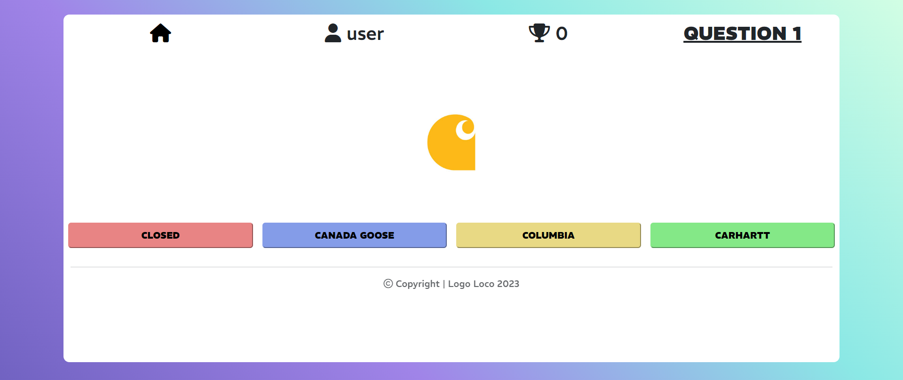

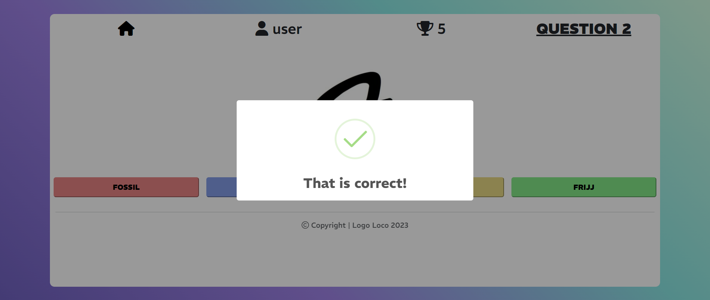

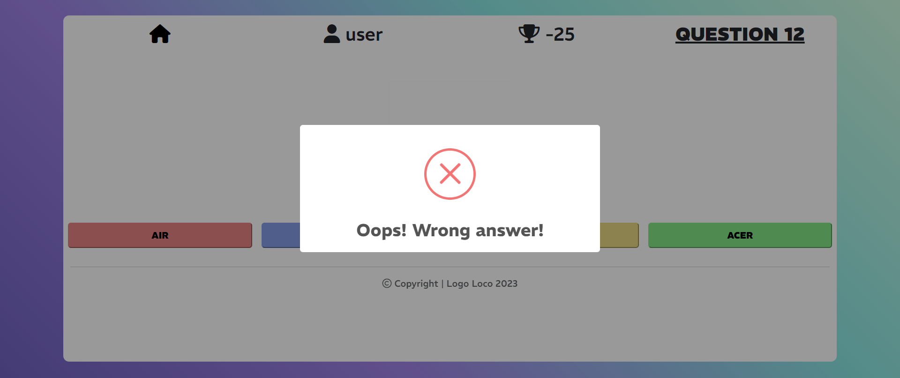

### End Page
* Upon completing the quiz, users are directed to the End Page.
* The final score is displayed along with a trophy icon for added visual appeal.
* Users have the option to play the game again with a "Play Again" button.

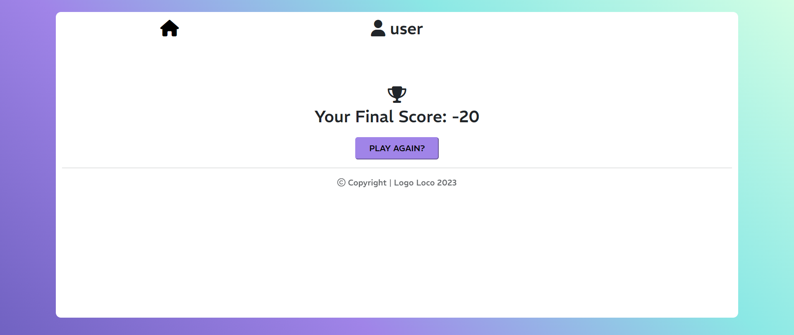

## Testing

### JSHint

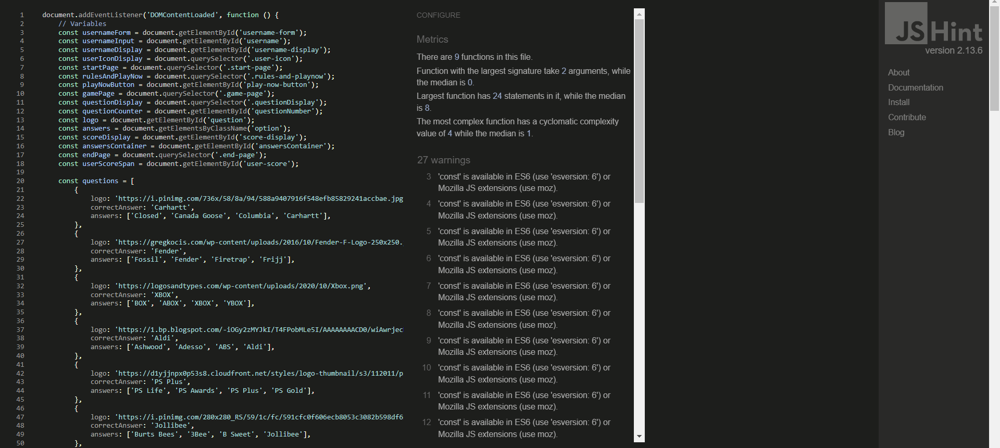

* Javascript code was validated and passed with no significant issues.

### W3C

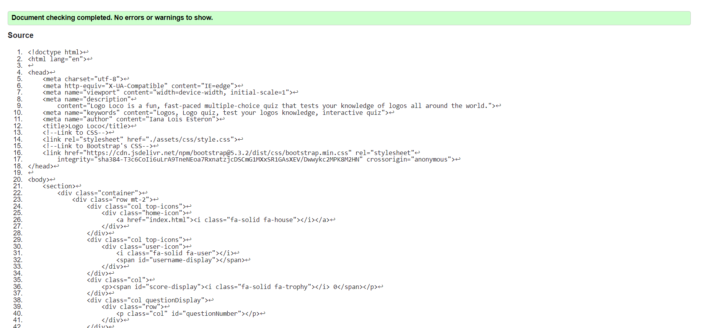

* HTML Code was validated and passed with no significant issues.

### Jigsaw

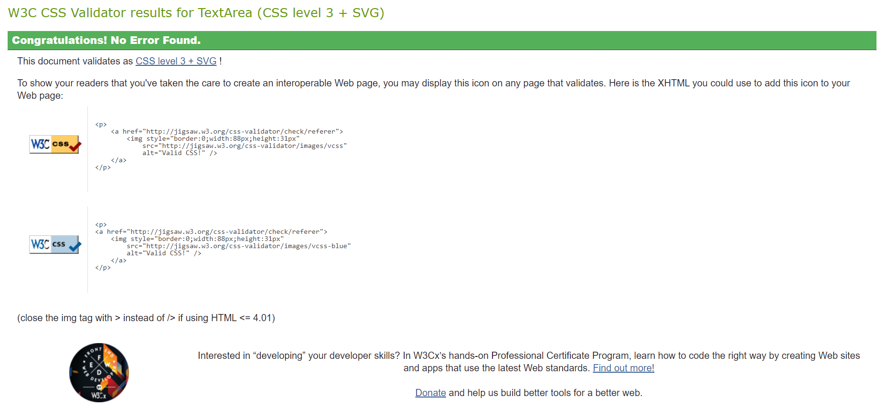

* CSS Code was validated and passed with no significant issues.

## Technology Used

* HTML, CSS & Javascript.
* [Google Fonts](https://fonts.google.com/) - Rem Font Family
* [Font Awesome](https://fontawesome.com/) - Logos used
* [Codeanywhere](https://codeanywhere.com/) - Cloud IDE
* [GitHub](https://github.com/) - Repositories
* [Color Hunt](https://colorhunt.co/) - Color Palette
* [Ui.Dev](https://ui.dev/amiresponsive/) - Responsive Sample Image
* [SweetAlerts2](https://sweetalert2.github.io/) - Answer Feedback Functionality
* [Balsamiq](https://balsamiq.com/) - Wireframes
* [Bootstrap](https://getbootstrap.com/) - Layout Responsiveness

## Deployment

The site was deployed to GitHub Pages. The deployment steps as follows:

* In the [GitHub Repository](https://github.com/IanaLois/CI-PP2-Logo-Loco), navigate to the Settings tab.
* From the source section drop-down menu, select the **Main** Branch, then click "Save".
* The page will be automatically refreshed with a detailed ribbon display to indicate the successful deployment.

The live link can be found [here](https://ianalois.github.io/CI-PP2-Logo-Loco/)

## Credits

### Content
* Allow some HTML elements in markdown lint rule MD033 was taken from [Stack Overflow](https://stackoverflow.com/questions/72368493/allow-some-html-elements-in-markdown-lint-rule-md033-in-visual-studio-code)
* Instructions on how to modify image size in markdown were taken from [Linux Hint](https://linuxhint.com/add-images-markdown-modify-image-size/#:~:text=For%20Modifying%20Image%20Size%20in%20Markdown%3A&text=We%20can%20change%20the%20size,of%20the%20image%20in%20Markdown)
* All other enquiries and assistance were answered and acquired from [MDN Web Docs](https://developer.mozilla.org/en-US/) and [W3Schools](https://www.w3schools.com/)
* The Logo Loco Quiz game was inspired by the youtube tutorial from Web Dev Simplified [Tutorial](https://www.youtube.com/watch?v=riDzcEQbX6k/)

### Media
* All logos are owned by their rightful owner and the original image url address was linked.
* All icons on this webpage were taken from [Font Awesome](https://fontawesome.com/)

### Acknowledgements
- I would like to thank my mentor Richard Wells for being very patient with me and giving me the encouragement I needed.